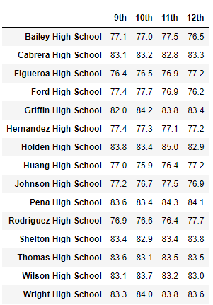
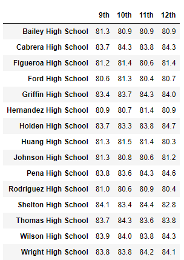

# School District Analysis

## Project Overview

Analysis has been completed for Py City Schools in regards to testing scores in math and reading for grades nine through twelve. Trends in performance were showing in regards to specific schools, school size, school budget, and school type.

After the initial analysis, there was evidence of academic dishonesty, specifically in the ninth-grade scores at Thomas High School.

The analysis for the district needed to be conducted a second time, with the ninth grade Thomas High School scores removed, and the results compared with the original analysis. 

The following questions are to be answered by comparing the analysis:
* How is the district summary affected?
* How is the school summary affected?
* How does replacing the ninth graders’ math and reading scores affect Thomas High School’s performance relative to the other schools?
* How does replacing the ninth-grade scores affect the following:
  * Math and reading scores by grade
  * Scores by school spending
  * Scores by school size
  * Scores by school type

## Resources

### Data Sources 

Schools_complete.csv

students_complete.csv

### Software 

Python 3.7.6

	Pandas
  
Anaconda 4.10.1

	Jupyter Notebook

## Results

The results of the comparative analysis can be seen in the data frames below. Each time data frames are shown, the first is the analysis completed including the 9th-grade math and reading scores from Thomas High School, and the latter showing those scores reported as NaNs.

### District Summary:

### Per School Summary:

Written description of replacing the ninth graders’ math and reading scores affects Thomas High School’s performance relative to the other schools

### Math Scores by Grade

### Reading Scores by Grade 

### Scores by School Spending 

### Scores by School Size 

### Scores by School Type

## School District Analysis Summary
